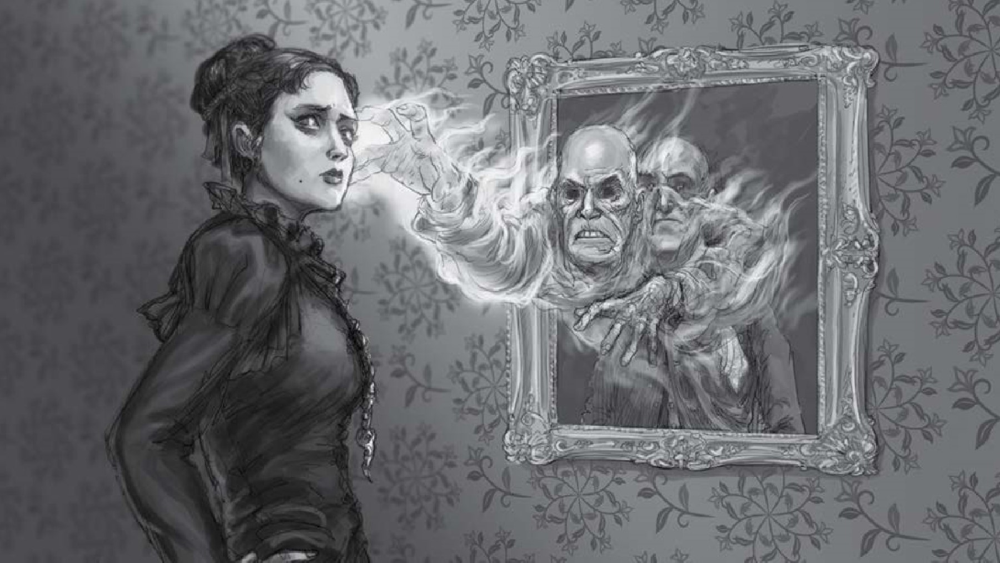
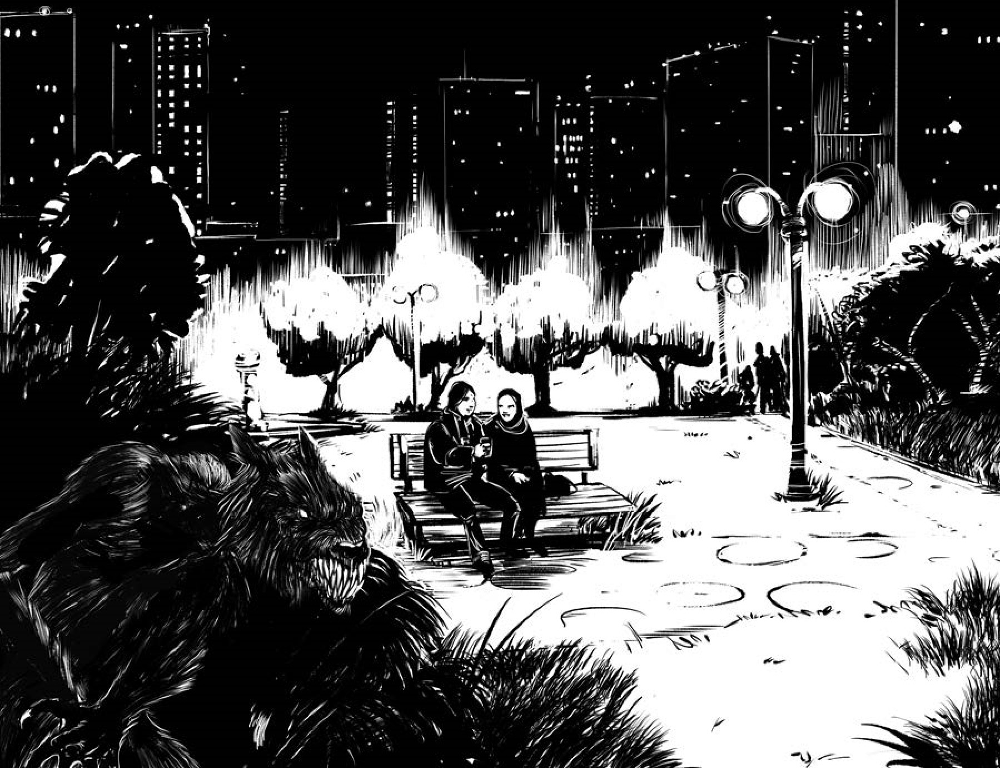

# Going Gothic

*By Marek Golonka*

The Gothic is the oldest horror genre and still remains an important vein of horror aesthetics. It’s easier to recognize than to define—you know it when you see it.

But how to make a Gothic *Monster of the Week* mystery?

# Gothic Is Psychological

Some define the Gothic as a portrayal of people who are uncertain about the boundaries of self, without a clear border between interior and exterior. Evil forces may seem to be only a projection of human fears and guilt, humans can seem to be an integral part of a haunted house (or other strange space) and it’s sometimes difficult to say what is real and what is not. To include this aspect of the Gothic in your mystery:

-   Create a monster that represents a great fear, guilt, or shame of one or more of the hunters.

-   Make the question “Is the monster real or imagined” the central problem of the adventure.

-   Create a bystander or minion who has no obviously monstrous nature or supernatural abilities and yet is really creepy or does things humans shouldn’t be able to do.

# Gothic Is Historical

In the Gothic, the past persists, haunts, and won’t let go. Characters are revisited by past misfortunes or their own crimes. Old emotions and deeds live on in unsettling ways. What was once done can’t be undone. All sorts of dead return to un-life—dead people, bygone conflicts, forgotten crimes, and extinguished passions. To include this aspect of the Gothic in your mystery:

-   Make the repetition of some old crime or atrocity a central theme of the mystery.

-   Create a monster or other threat that can haunt people with their worst memories and learn their darkest secrets.

-   Start a mystery with a flashback to the long-forgotten past and make the consequences of that flashback important (and really awful).

# Gothic Is Social

The Gothic often uses the supernatural and monstrous to show real social conflicts and traumas in an exaggerated form. Monsters can be based on repressed groups and social outcasts, showing their anger in monstrous proportions but also pointing out that they are victims. At other times, the opposite happens—the monster is an exaggeration of a group that is privileged but feared or loathed. Supernatural threats faced by the heroes can have effects strangely similar to real-life oppressive mechanisms of society, family, or relationships.

To include this aspect of the Gothic in your mystery… first and foremost, be careful. This aspect of the Gothic is the most delicate to handle and has the greatest risk of being uncomfortable for the players—but if done right it can lead to a really important, deep experience. Talk with your players about their comfort zones and taboo topics. Be sure to use a safety tool like an X-card. And, maybe, use these ideas:

-   Create an evil that can’t be defeated as long as a social injustice remains.

-   Neglect or discrimination of some people is the source of the mystery’s threats.

-   Make the monster a member of a privileged group and a symbol of this group’s excesses.

For me, it’s convenient to think of the Gothic as ‘human horror’ as opposed to H.P. Lovecraft’s ‘cosmic horror.’ In Gothic stories, the human mind and soul aren’t insignificant in the vast universe; they’re dangerous, twisted, and labyrinthine—and it’s from human minds that evil crawls into the world.

# Sample Gothic Mystery: A Perfect Park

To show how to ‘Gothicise’ a mystery, let’s start with a cliché idea and surround it with layers of the Gothic.

Idea: a werewolf hunts in the city park at night.

Let’s start with the historical and the social. Three years ago, the park was ‘revitalised’—which made it nicer and safer but the homeless living there were brutally cast out of their shelters. This creates a feeling of anger and social injustice that, in a Gothic story, can be connected to the supernatural event. So let’s assume the werewolf isn’t just a man-turned-wolf but the collective spirit of anger and desperation of people with no place to go. He attacks as a human-shaped wolf but he can be turned human by **using magic** or keeping him trapped until daylight. In human form, his looks will morph—taking on the different appearances of the cast-out homeless—and he’ll only be able to talk of feeling abandoned and despised, unable to say who he is or where these feelings come from.

To make it psychological—and thicken the plot—let’s assume that the politicians and policemen directly responsible for casting out the homeless are dreaming of this werewolf and they feel drawn to the park at night. This shows how their past misdeeds haunt them but also allows you to put them in dangerous situation or suggest that one of them is the werewolf.

Let’s add the fact that the werewolf kills anybody he encounters—he is too wrathful to make distinctions about who is really responsible—but he only takes one life for every homeless person who dies after being evicted from the park. That directly links the monster with the injustice done and also gives a potential clue: if the hunters look closely, there is always a report of a homeless person dying a few hours before an attack in the park. Besides, it allows the story to begin long after the renovation—a harsh winter is coming, the homeless are in real danger, and the spiritual embodiment of their desperation becomes really powerful and dangerous.

The ‘past’ in this sketch is really recent—three years—but in a modern

Gothic story this can be fine because it’s enough for the society to forget about the renovation and its cost. We might add, however, that the city was created by banishing a group of people appropriate to the setting from their ancestral terrain. This will add a Gothic sense of repeating past mistakes while also providing additional clues.

With this sketch we have a supernatural threat, a central location— the park—and a complex social theme. That’s more than enough to help a Keeper invent a cast of bystanders to populate the story and run it as an exciting mystery full of lively characters and touching social issues.

But remember: it’s always touchy and requires lots of care. One player could say this story is a good reminder of how society shuns some people for the benefit of the more accepted ones and of how the anger of dispossessed groups can become dangerous. Another player could say that it’s too sad to be a topic of a game or that it uses real human misery in a stereotyping way. So while designing and running such mysteries, remember to talk with your players beforehand; see what’s acceptable for them (with as few spoilers as possible!); make sure to populate the story with characters instead of stereotypes; and, finally, propose a way for your players to signal that a part of the story isn’t OK for them.

[[Monster Hunting At Work]]