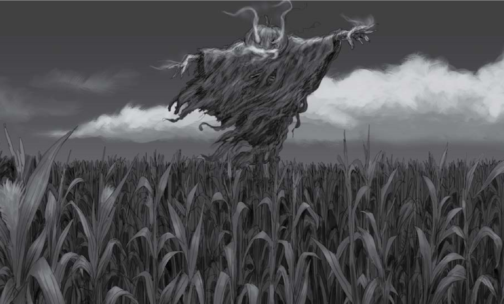
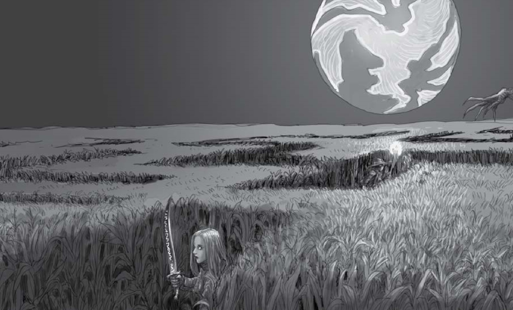
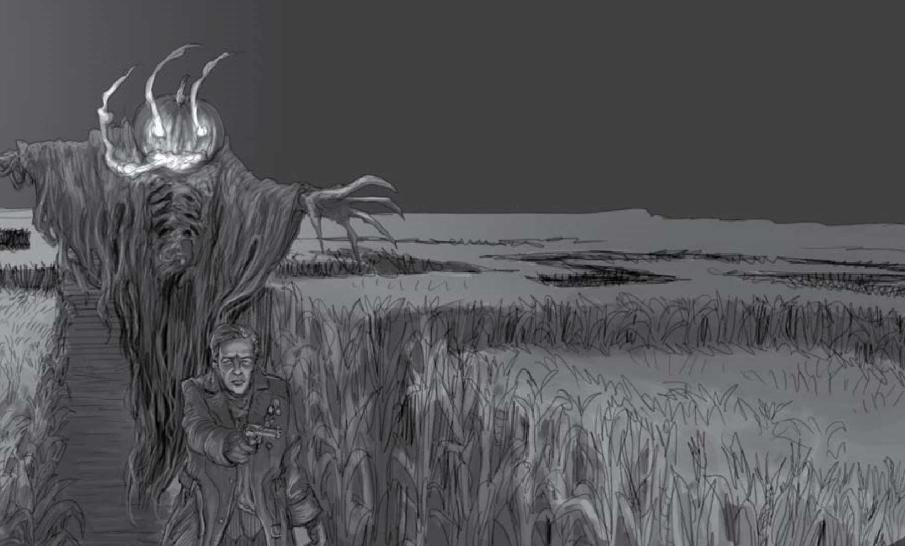

Going to Pieces

*By Sophie Lagacé*

# Concept

A series of animal mutilations and killings are blamed on Preĝo practitioners. But the latter are really trying to ward against a new threat: a necromancer preparing a ritual that will grant mastery over an army of nightwalkers (the immigrants are calling them “chupacabras”). Nightwalkers have already started hunting in the Cook County forests, where the Preĝo community practices their religion.

This mystery assumes the necromancer is an old foe of the hunters who was defeated and now plans revenge. Fill in the details for a suitable character from your game.

## Preĝo

This is a fictitious syncretic religion, built from aspects of the community’s ancestral cultures and influences from other cultures since leaving their homelands (which was not always voluntary). The name comes from the Esperanto word for “prayer.” Preĝo practices include wilderness shrines at sacred places, and some animal sacrifice.

# Hook

The hunters investigate the latest in a series of animal killings in Cook County Forest Preserves. Dead goats and chickens have been found at

Oak Glen Preserve in a Chicago neighbourhood along the northern edge of the city.

# Countdown

<table><colgroup><col style="width: 23%" /><col style="width: 76%" /></colgroup><thead><tr class="header"><th><strong>Day</strong></th><th><blockquote>
Preĝo worshippers are blamed for animal mutilations and killings.
</blockquote></th></tr></thead><tbody><tr class="odd"><td><strong>Shadows</strong></td><td><blockquote>
Kathy Witecki is found unconscious and badly wounded in the woods. She stays in a coma.
</blockquote></td></tr><tr class="even"><td><strong>Sunset</strong></td><td><blockquote>
Billy Washington disappears, captured by the Necromancer.
</blockquote></td></tr><tr class="odd"><td><strong>Dusk</strong></td><td>The ritual begins.</td></tr><tr class="even"><td><blockquote>
<strong>Nightfall</strong>
</blockquote></td><td>The victims (Billy and possibly others) are sacrificed.</td></tr><tr class="odd"><td><strong>Midnight</strong></td><td>The ritual is completed and horrors are unleashed when the Necromancer summons and binds all nightwalkers within the spell’s range.</td></tr></tbody></table>

# The Necromancer

*Monster: Sorcerer (motivation: to usurp unnatural power)*

He remembers when the hunters defeated him before, oh yes he does. They killed him once; he wants to return the favour. He selected the nightwalkers as his tools because they are a corrupt form of werecreatures: he plans on draining the hunters of life and having them torn to pieces by nightwalkers. **Powers:**

-   **Phylactery**: Keeps his soul safe.

-   **Powerful Magic**: Can use any of the normal **use magic** effects freely.

-   **Advanced Arcane Training**: He only needs two out of Foci, Gestures, and Incantations to perform magic.

-   **Necromantic Blast, Necromantic Wall, Withering Touch, Memory Theft** (see attacks below). **Attacks:**

-   **Ritual dagger** 2-harm hand.

-   **Necromantic blast** 2-harm close magical obvious ignore-armour life-drain.

-   **Necromantic wall** 1-harm close magical barrier 1-armour obvious loud life-drain.

-   **Withering touch** 4-harm intimate magical obvious ignore-armour life-drain.

-   **Memory theft** 0-harm intimate magical ignore-armour 1-memory.

**Armour:** 1-armour (always prepared!)

**Harm capacity:** 12 harm, but will flee when he receives 6-harm.

\[\]\[\]\[\]\[\]\[\]\[\] Flee \[\]\[\]\[\]\[\]\[\]\[\] Dead

**Weakness:** A **big magic** ritual is required to wrench his soul from its phylactery and destroy both soul and phylactery. It must be performed within one midnight of his death (before or after) and takes six hours to cast. It requires the phylactery itself, **use magic**, and several rare ingredients that might be mysteries in their own right to obtain.

# Preĝo Believers

*Bystanders: Victims (motivation: to put themselves in danger)*

Mostly of Latinx and Afro-Caribbean descent. They might go out looking for the people really behind the animal killings, or be on the streets to patrol and defend their community. They could even regard the hunters as a threat—who are these people hanging around asking questions?

**Attacks:** **Ordinary weapons** 2-harm hand/close.

# Nightwalkers

*Minions: Brutes (motivation: to intimidate and attack)*

A couple of nightwalkers who are already on board with the Necromancer’s plan, either for their own reasons or because he subdued them. They look like like large misshapen dog silhouettes made of pure darkness, bristling with spines, their red eyes glowing like embers. **Powers:**

-   **Night Walker**: A nightwalker can disappear into the darkness, reappearing in its den. It cannot be tracked home, as it did not walk through the intervening space.

-   **Horrifying Yell**: Anyone who hears the howl of the nightwalker must take –1 ongoing unless they **act under pressure** to resist the fear. **Attacks:**

-   **Bite** 1-harm hand.

-   **Blood-suck** (must **bite** first): 2-harm intimate.

**Armour:** None. **Weaknesses:**

-   Sunlight.

-   Magic.

-   Enclosure (if you can trap it within an enclosed area, it may not night-walk away and may be killed).

**Harm capacity:** 5 harm, but they will flee when they reach 3 harm.

\[\]\[\]\[\] Flee \[\]\[\] Dead

# Kathy Witecki

*Bystander: Witness (motivation: to reveal information)*

A retired Chicago Police Department deputy chief. She has lived near the edge of Oak Glen for 40 years. She is an older white woman with short gray hair, sharp eyes, and a fit and trim body. She sees a lot but she no longer gets paid to stick her nose in other people’s business.

*“Every time you see the blood, it brings a little horror back to you—you always feel for the animals, you know?”*

# Billy Washington

*Bystander: Innocent (motivation: to do the right thing)*

Has worked in the Cook County Forest Preserves for 36 years as part of the landscape maintenance crew. Ageing black man with thinning curly gray hair, timid eyes, and gnarly knuckled-hands, of medium height and stocky frame. He’s a peaceful man who loves to work outdoors, except on really cold and rainy days (snow is okay). He lets people be, but he’s well aware he could be blamed for the incidents (remember the 1996

Atlanta Olympics bombing?)

*“I’d just be guessing. I’m American, I don’t know nothing about that ritual stuff.”*

# Dr. Craig O'Sullivan

*Bystander: Gossip (motivation: to pass on rumours)*

A Northwestern University theology professor, who has studied Preĝo as part of his research. A frail elderly white man with thinning wispy white hair and horn-rimmed glasses. He can go on for hours about minute theoretical details but he stayed well away from going to look at the dead carcasses himself. That’s what grad students are for.

*“Preĝo sacrifices are strict and respectful. Prayers have to be said, the blade has to be a certain style and sharpness. It’s as humane a killing of an animal as can be.”*

Debra Priest, Esq.

*Bystander: Busybody (motivation: to interfere in other people’s plans)*

A real estate attorney, NWU lecturer, and animal rights lawyer who is a former director of Chicago’s Animal Control Department. A white woman with long, curly, slightly graying hair, a medium body, and a friendly attitude which turns to anger when she talks about harm to animals. She genuinely cares about animal protection, but she also deplores that the animal killings lower property values in otherwise nice areas nearby.

*“Illinois’ Humane Care for Animals Act is a neutral law; it’s not true that we’re targeting religious activity.”*

# Callista Theodorakis

*Bystander: Skeptic (motivation: to deny supernatural explanations)*

Cook County Forest Preserves spokeswoman and former reporter at local station WCHI-TV. A trim, handsome, white but dusky woman in her late 40s, with shoulder-length brown hair, and an easy poise.

*“We respect everyone’s freedom of religion, but if we see someone suspicious, we’ll take action under the state law.”*

# Gabriela Cruz

*Bystander: Helper (motivation: to join the hunt)*

Runs Botanica de San Jeronimo on the South Side. An older hispanic light-skinned ‘morisca’ woman with a white headscarf, big glasses and a wide smile. She is short and chubby. Gabriela is a herbalist and an advocate for and member of the Preĝo community. She also holds a degree in Pharmacology but doesn’t brag about it unless she needs to placate the law enforcement.

*“A lot of people, they misunderstand us. They think we work with the devil, but it’s not like that.”*

# Botanica de San Jeronimo

*Location: Wilds (motivation: to contain hidden things)*

On the South Side, Gabriela Cruz’ herbal shop. Non-hispanics mostly just call the place “Botanica.” The place is filled with little bottles, envelopes filled with dried herbs, an array of teapots, strainers, vaporizers, candles, statuettes of the saints, charms, calendars, etc.

# Forest Preserves

*Location: Maze (motivation: to confuse and separate)*

The first Forest Preserve the hunters will encounter is likely to be Oak

Glen, but this write-up can work for most of them. Many facilities can be found near the entrances of each preserve location (over 300 sites in the district!), but the woods soon thicken with distance, especially in the locations where incidents have occurred. Some—but not all—preserves have well-marked trails, picnic tables, interpretive signs (sometimes duplicated), and even lodges. But away from these, the underbrush gets thick and the trees grow close together.

**Custom moves:**

When you **search in the forest**, roll +Sharp:

-   On a 10+, things seem to point somewhere in particular: take +1 forward for investigating.

-   On a 7-9, you can **investigate a mystery**, but then pick one of the bad things below.

-   On a miss, all three bad things are true. Bad things that can happen in the forest:

-   Something is following you.

-   You are lost, and your phone and GPS are not working properly.

-   You stumble upon something abominable.

# Wolf Road Woods Forest Preserves

*Location: Den (motivation: to harbor monsters)*

The hunters’ investigation of Billy Washington’s disappearance will eventually lead them to Wolf Road Woods, where the nightwalkers have their temporary lair.

**Custom moves:**

When you **search in Wolf Road Woods**, roll +Sharp:

-   On a 10+ you find a tuft of strange hair and a well-worn work glove with Billy’s initials: take +1 forward for investigating, then the Keeper will pick one of the bad things from **search in the forest** (see above).

-   On a 7-9, you find the clues but all three bad things are true.

-   On a miss, you are attacked by nightwalkers.

# Information That Can Be Gathered

Animal parts have shown up in Cook County Forest Preserves to the west, south and northwest of the city, according to half a dozen police reports filed this year and last year. Most of the time, it’s just the parts.

In cardboard boxes, plastic sacks, or at the base of a tree clustered with tokens of ritual—a swatch of red or white cloth, a little wooden box—they’ve been finding chicken heads with their eyes gouged out, and dismembered goats. Just last weekend, blood stains on newly-fallen snow led residents to two baby goat heads and a number of chicken parts, wrapped up in red bandanas. *Basic:* Animal remains found include chickens (both hens and roosters), goats, pigeons, rabbits, cat, skunk, and deer carcasses. *Advanced:* Only the livestock remains were accompanied by red and white cloth strips.

According to residents near various Forest Preserves, this has been going for at least 30 years.

Only once in recent memory—the incident the hunters are investigating—has a report come in of someone being caught in the act of a suspected ritual sacrifice. A few days ago, a caller reported seeing five people “dressed all in white” in Oak Glen: they appeared to be “doing animal sacrifices on chickens and roosters.” By the time the police arrived, there was nothing to see.

The Cook County Forest Preserves encompass about 70,000 acres

(280 square kilometers)—11 percent of the county. About 100 officers police the area.

**If the hunters correlate sites over time and area:** although it’s hard to discern by looking at a specific location, incidents across all forest preserves in Cook County have suddenly increased in frequency.

Live animals, possibly escaped from attempted sacrifices, have been found wandering in the woods.

Small makeshift altars have also been found in the woods, with candle stubs, wilted flowers, keepsakes, images of saints, and dried herbs. The herbs and other ingredients include tobacco, jimsonweed (datura), foxglove (digitalis), Jesuit’s bark (quinine), garlic, velvetleaf, lemongrass, thyme, and monkshood (wolfsbane), honey, powdered eggshell, cocoa butter, ash, aguardiente, and water.

**Investigating the magics performed at the altars** requires a lot of legwork to examine many sites. *Basic:* A variety of magics were performed: blessings, divinings, intercessions, atonements, and even the rare curse; some altars show no magic at all. *Advanced:* The most recent magics have been wardings.

**Investigating the attack on Kathy Witecki:** *Basic:* Kathy walked away from the path that day, and towards an altar. *Advanced:* She actually checked on several spots in the preserve where incidents had been reported over the years.

**If Kathy wakes up after the attack and the hunters interview her:** *Basic:* Kathy has suffered from the Necromancer’s memory theft attack. Her memory is affected and she can’t recall much from the day of the attack, except a dark shadow with long spikes, and a man with eyes like glowing embers. *Advanced:* Even some details that she recently told the hunters have been forgotten.

**Investigation of Billy Washington’s disappearance:** *Basic:* He was working alone at the time of the attack and was near a forest altar— tending it. *Advanced:* Close examination by a knowledgeable person would suggest Billy didn’t exactly know what he was doing; he was just trying to fix it up as best he could.

# Resources

Forest Preserves of Cook County. http://fpdcc.com/

Harvest Maze

*By Mark Tygart*

*“Even a mouse will get tired of a maze after a while.”*

—Anthony T. Hincks

# Concept

The hunters investigate a couple’s ‘disappearance.’

This mystery was inspired by the first season *Supernatural* episode

“Scarecrow,” Stephen King’s *Children of the Corn*, Hispanic legends about the Coco, and the tradition of eerie holiday corn mazes in the American Midwest.

# Hook

A series of disappearances—of multiple victims—around the same date every year has this small town’s police worried about a possible serial killer.

Either law enforcement or family members of the victims may ask the hunters to help. A Flake could notice the cycle of disappearances or be tipped off by a crime reporter. The victims share no discernible pattern of class, age, geography, ethnic group, or religious faith. All they have in common are the dates of their disappearances.

The first missing person was notable UFO expert, right wing pundit, and radio talk show host Erica Kripke. She disappeared seven years ago while investigating crop circles. This led to claims from her associates of government conspiracy and/or alien abduction. Her empty car was found next to a cornfield.

Last year it was Fabian Giroux. A retired, gay high school teacher and Canadian immigrant who disappeared in the area while sightseeing in his Winnebago. He had several cats, all named after members of the British Royal Family. The cats and the Winnebago were found on the side of the road but Professor Giroux vanished. He left no family.

The most recent disappearance, just two days ago, was a local teenaged couple: Rebecca Selby and David Kirchner. Their car was found in a popular ‘make-out’ spot near the Guzman farm, with no sign of them. There were no signs of violence. They were popular, with good grades, and seen as a model young couple. Their families remain worried.

# Overview

The disappearances were victims of a coco, caught in the enchanted maze it creates in a local cornfield to “celebrate the holidays” each year.

# Countdown

<table><colgroup><col style="width: 23%" /><col style="width: 76%" /></colgroup><thead><tr class="header"><th><strong>Day</strong></th><th>The coco, disguised as a chupacabra, begins stalking the area again for more victims and is seen by Vanessa Guzman.</th></tr></thead><tbody><tr class="odd"><td><strong>Shadows</strong></td><td>The reporter publishes a story about the disappearances which causes a local panic.</td></tr><tr class="even"><td><strong>Sunset</strong></td><td>The sheriff explores the maze and retreats after experiencing demonic illusions caused by the coco.</td></tr><tr class="odd"><td><strong>Dusk</strong></td><td><blockquote>
Sheriff becomes deranged by the coco’s illusions and becomes obsessed with searching for a one-armed criminal mastermind and Satanic cult leader.
</blockquote></td></tr><tr class="even"><td><blockquote>
<strong>Nightfall</strong>
</blockquote></td><td><blockquote>
Coco lures the reporter into the maze and drains them, creating a new coco.
</blockquote></td></tr><tr class="odd"><td><strong>Midnight</strong></td><td><blockquote>
Coco (with new friend) departs the area until next year’s holidays.
</blockquote></td></tr></tbody></table>

# Coco

*Monster: Trickster (motivation: to create chaos)*

A mythical ghost-monster from Hispanic and Lusophone folklore

The coco is a murdered child who has become a shapeshifting vampire preying on the living.

The coco is an undead, murdered child that preys on the living. Victims killed but not consumed by a coco will arise as another coco within three days of being drained.

The coco’s true form is hideous: a twisted, half-melted corpse child in rags. It normally appears as a cloaked figure (sometimes with a jacko’-lantern head) or shifts to another form. It dislikes, but can endure, sunlight. It will normally not cross salt or running water.

**Powers:**

-   **Shapeshifter**: It can appear as anything roughly between human to childsized, but radiates it magic and evil strongly.

-   **Illusions**: As well as creating spooky mazes, it can surround itself with confusing visions when attacked, forcing hunters to **act under pressure** to take action.

-   **Life Drain**: See the **life drain countdown** below for the process. Hunters have a chance to intervene and stop the process after each step, if they are close enough.

**Weakness:** The sound of protective prayers.

**Attacks:** **Strike with fists** 1-harm hand. **Draining grip** 0-harm hand life-drain.

**Harm Capacity:** 7. \[\]\[\]\[\]\[\]\[\]\[\]\[\]

**Armour:** None

**Custom Moves:**

**Escaping The Coco**: When you are having your life drained by a coco and try to break free, roll +Tough:

-   On a 10+, you break the coco’s grip. You are free!

-   On a 7-9, choose to escape but suffer 1-harm and move to the next Life Drain countdown level, or resist for the moment but stay in its grip.

-   On a miss, you immediately suffer the next two countdown entries. **Life Drain Countdown**:

-   Day: The hunter is immobilised in pain.

-   Shadows: Extreme pain.

-   Sunset: Pain induces 1-harm.

-   Dusk: Pain induces 3-harm.

-   Nightfall: The hunter is unconscious.

-   Midnight: The hunter is drained and consumed by the coco.

# Guzman Farm

*Location: Crossroads (motivation: to bring people, and things, together)*

The couple was last seen near a cornfield on the Guzman farm.

A recent immigrant success story, the Guzmans operate something that is becoming exceedingly rare: a family farm. The disappearances have been clustered around this area, as well as a largely disregarded series of chupacabra sightings by drunk local teenagers (which were the coco, of course).

When investigating the cornfield the hunters will suddenly hear a women’s scream amid the corn. If the field is entered they will find themselves in a strange misty corn maze after dark (no matter the actual time).

# Vanessa Guzman

*Bystander: Witness (motivation: to reveal information)*

A bright, attractive young woman hoping for a career in the arts, she often acts as a translator for her father Fidel in business matters (despite his long residence here, he is uncomfortable speaking English).

Vanessa is convinced the “chupacabra” is a prank, because she could hear a child laughing when she saw the “small creature” in the cornfields. She wonders whether the local kids are faking a monster to create excitement in an otherwise sleepy agricultural community.

# Fidel Guzman

*Bystander: Official (motivation: to be suspicious)*

A man obsessed with making his family farm a success, Fidel becomes warm and friendly if addressed in Spanish. A pragmatic man, he worries that criminals are murdering and robbing travelers, and that the local police are trying to cover this up with ghost stories.

# The Coco's Corn Maze 

*Location: Den (motivation: to harbour monsters)*

An illusionary labyrinth created by the coco to ‘play’ with its victims. It is always night in the maze, with a full harvest moon. The stars match no known constellations. If the coco is killed, the illusion vanishes and the hunters find themselves randomly dispersed through the Guzman corn fields.

# Josh Lopez, Noisy Reporter

*Bystander: Busybody (motivation: to interfere in other people’s plans).*

Josh is a young, bright, ambitious reporter from an impoverished immigrant family. He believes a serial killer targeting Hispanics has been operating in the area. Josh is fascinated with serial killers, and believes this case could also expose an American society deeply prejudiced and indifferent to the suffering of minorities.

He will try to enlist the hunters in any number of research activities that alienate the local authorities and produce little useful information.

Josh is skeptical of the supernatural, but his childhood was full of stories of folklore, including the coco.

# Molly Gunderson, Sheriff

*Bystander: Official (motivation: to be suspicious)*

Like most local law enforcement officers, Molly Gunderson finds Josh

Lopez to be highly annoying, but she secretly shares his concerns about a possible serial killer operating in the area. She is convinced that the disappearances are the work of a “Children of the Corn” satanic cult that is active among the local farm workers.

A middle-aged disappointed veteran of an often sexist rural law enforcement office, Molly has fallen victim to the consolations of a rather extreme Christian cult.

# Bridget's Diner

*Location: Hub (motivation: to reveal information)*

Everybody in this rural area meets at Bridget’s, a local institution offering wonderful middle-American food at reasonable prices. There is nothing fancy about Bridget’s but it is clean, the staff are friendly, and the pies are delicious. Sadly the coffee is not “damn fine.”

Both Josh Lopez and Melinda Gunderson are more likely to be found “talking shop” here with locals than in their respective offices.

[[Haunting at the Old Grand]]