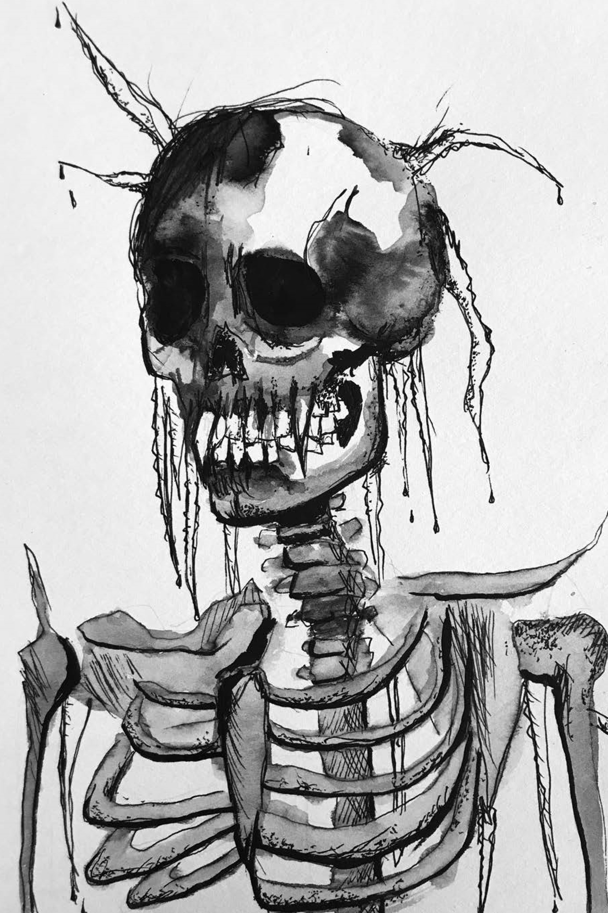
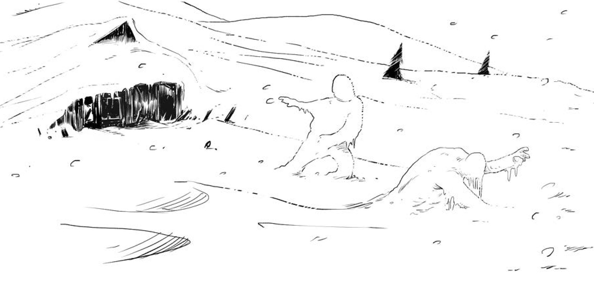
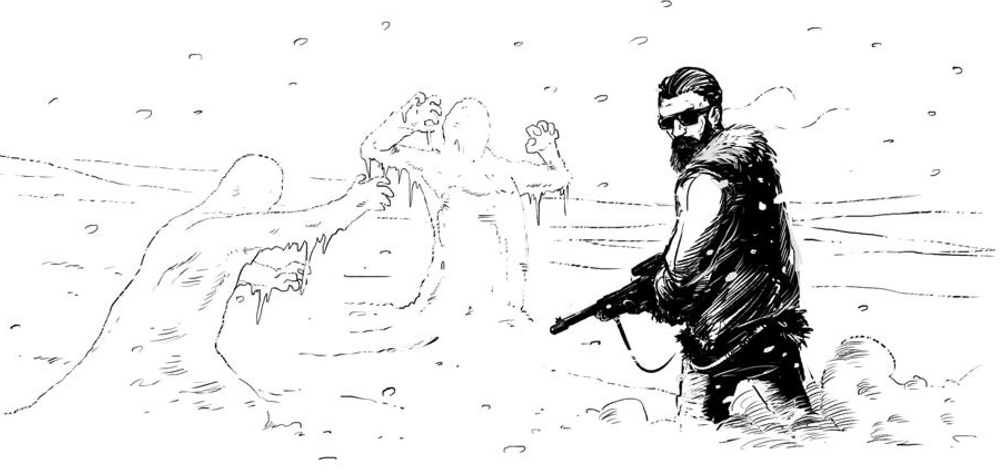

Special Snowflake

*By Sean Clancy*

# Concept

An alien satellite has crashed near a snow machine at at a remote ski resort. Hijacking the snow machine system, the satellite has created the Squall, a killer snowstorm.

The Squall acts like the classic horror icon the Blob, but it thrives in the cold and avoids heat.

# Hook

Pick one of these:

-   News reports about the impact of a “small meteorite” near Havenhills Ski Resort.

-   Harry Reynolds, planetary science researcher, is seen shivering and half frozen at Marie’s Sportin’ Goods, muttering about “the event” just a few hours after the meteorite impact.

-   A Flake, Professional, Expert, or other hunter with appropriate contacts might have access to NASA spectroscopy data which suggests the meteorite is made of an unknown material.

-   The hunters are rewarding themselves with some R&R at Havenhills Ski Resort, when the satellite strikes nearby one morning.

# Countdown

<table><colgroup><col style="width: 25%" /><col style="width: 74%" /></colgroup><thead><tr class="header"><th><strong>Day</strong></th><th>The Squall kills a bystander who gets too close to the satellite.</th></tr></thead><tbody><tr class="odd"><td><strong>Shadows</strong></td><td>The satellite hijacks the other two Havenhill snow machines.</td></tr><tr class="even"><td><strong>Sunset</strong></td><td><blockquote>
Snow Buddies loot cellphones from the Squall’s frozen victims.
</blockquote></td></tr><tr class="odd"><td><strong>Dusk</strong></td><td><blockquote>
Snow Buddies upgrade the alien satellite’s broadcast range.
</blockquote></td></tr><tr class="even"><td><blockquote>
<strong>Nightfall</strong>
</blockquote></td><td>The alien satellite begins uploading its malicious code to the web.</td></tr><tr class="odd"><td><strong>Midnight</strong></td><td><blockquote>
Snow machines worldwide spew out killer snow, killing thousands.
</blockquote></td></tr></tbody></table>

# Notes

A number of the attacks in this mystery have cold ignore-armour effects. You should assess if the hunters have ‘cold armour’ based on what they describe themselves wearing. Regular winter or ski gear is 1-cold-armour and serious mountaineering gear would be 2-cold-armour. In either case, this armour applies only to cold-based harm. Supernatural or other special hunter armour may work against the cold as normal.

# The Squall

*Monster: Devourer (motivation: to consume people)*

A swarm of crystalline nanomachines, manufactured by Havenhill’s hacked snowmakers. To anyone who inspects a sample with a microscope, its snowflakes are clearly identical and artificial. **Powers:**

-   **Deadly Cold**: The living storm freezes anything it surrounds. Any hunter who gets close to the Squall (intimate/hand range) takes 1-harm, cold ignore-armour.

-   **Formless**: The Squall can flow into small spaces and cracks, and isn’t harmed by physical attacks like gunfire or martial arts—only fire or explosions.

-   **Lightweight**: The Squall can effectively fly on the wind, but not very fast.

**Attacks:** **Small gust** 1-harm close cold ignore-armour. **Big gust** 3-harm close cold ignore-armour forceful. **Avalanche** 5-harm far cold ignore-armour forceful area. **Armour:** 0

**Harm capacity:** 12. \[\]\[\]\[\]\[\]\[\]\[\]\[\]\[\]\[\]\[\]\[\]\[\]

**Weaknesses:**

-   Disabling the snow machines. Deactivating the resort’s snow machines will prevent the storm from replenishing, as will capturing or destroying the alien satellite.

-   Spring. If enough time passes (1-3 days, depending on the pace of the investigation) the Squall will melt in the encroaching spring weather.

# Snow Buddies

*Minion: Thief (motivation: to steal and deliver to the monster)*

Havenhill just had its annual snowman contest: the “Snow Buddies

Festival.” The Squall has animated these sculptures with tendrils of ice that form a rudimentary skeleton.

Snow Buddies are coordinated, and can perform fine manipulation. They also have a strange fixation: stacking the frozen chunks of their victims to create Snow Buddy ‘meatmen,’ which the Squall will also animate.

When they’re not sculpting, Buddies will try to collect electronic communication devices to increase the alien satellite’s broadcast range. **Powers:**

• **Festive Camouflage**: Snow Buddies are difficult to spot in the storm.

**Attacks:** **Twiggy claws** 1-harm hand. **Icicle fangs** 3-harm intimate. **Armour:** None.

**Harm capacity:** 4. \[\]\[\]\[\]\[\] **Weakness:** Heat.

**Note:** Meatmen have the same stats and abilities as Snow Buddies, just... more gross.

# The Maudsley Hotel

*Location: Crossroads (motivation: to bring people and things together)*

The Maudsley is Havenhill’s sprawling, shag-carpeted hotel. All guests check in at the front desk. Though in fair condition, the Maudsley isn’t built to withstand extreme weather. The main lobby’s high bay windows are prone to shattering, and the building’s size makes it a pain to heat.

# Private Cabins

*Location: Prison (motivation: to constrain and prevent exit)*

For the well-off, a private cabin means barely having to leave the expert slopes on the far side of the resort. Each of the dozen or so private cabins are restocked weekly with food and supplies, including firewood, gasoline, and emergency flares. Sturdy, but in bad weather they’re cut off from the hotel.

# The Slopes

*Location: Deathtrap (motivation: to harm intruders)*

Bystanders and hunters caught outside when the Squall flares up are going to have a rough time. There’s little protection on the slopes or in the woods, and the Squall will quickly kill anyone who doesn’t shelter indoors.

# The Maintenance Shack/ Alien Satellite

*Location: Hellgate (motivation: to create evil)*

Dawes’ unofficial office is appointed with rusty tools and jerry cans of gasoline. The alien satellite will be attached to one of three ‘Flurrious XL’ snow machines, which are networked together and spread along the ridge by the shack. The satellite can be detached from its host machine by hand, and is easily broken once removed.

# Hardee Dawes, resort manager

*Bystander: Busybody (motivation: to interfere in other people’s plans)*

Dawes is desperate to get the most out of the waning ski season. He’ll be hostile towards attempts to inspect or shut Havenhill’s snow machines down, and will summon his security team (Carl and Carla) if he catches any hunters snooping around staff-only zones.

# Brent Havenhill, affluent ski pro

*Bystander: Victim (motivation: to put himself in danger)*

Brent’s family owns Havenhill (“…and don’t you forget it!”), and he grew up on the resort’s slopes. Even when people start turning up frozen solid, Brent’s going to bomb around until he’s killed or sees someone killed firsthand.

# Asa Kaplan, check-in receptionist

*Bystander: Witness (motivation: to reveal information)*

This is Asa’s third year at Havenhill, but her first at check-in. She’s bright, capable, and good with faces, including that of the excitable grad student who just rented a room. (That said, she’s also been pulling double OT for the past two weeks.)

# Harry Reynolds, planetary science researcher

*Bystander: Helper (motivation: to join the hunt)*

Harry is a graduate student drawn to Havenhill by the meteor strike. Though he’s primarily concerned with collecting data for his doctorate, at the first sign of alien activity Harry will reveal a passion for UFO-chasing.

# Carl Fresno, underpaid security

*Bystander: Innocent (motivation: to do the right thing)*

Like, Carl’s just here to make some extra scratch for the season, dude. He doesn’t want to get mixed up in anything. Dig?

# Carla Monteiro, senior underpaid security

*Bystander: Official (motivation: to be suspicious)*

Carla doesn’t make damn near enough, considering how capable she is. She definitely doesn’t make enough to be stuck with layabout Carl as the season winds down.

# Custom Moves

**Warming Up Again**: When **a hunter warms up after being exposed to the Squall**, they heal 1 cold harm for every ten minutes spent near a heat source (raging fire, radiator, electric blanket, etc.). If the hunter has taken 4-harm or more, they still need to be stabilized, as normal. Other kinds of harm (stab wounds, burns, hurt pride) can’t be healed using this move.

[[The Torch Comes To Town]]